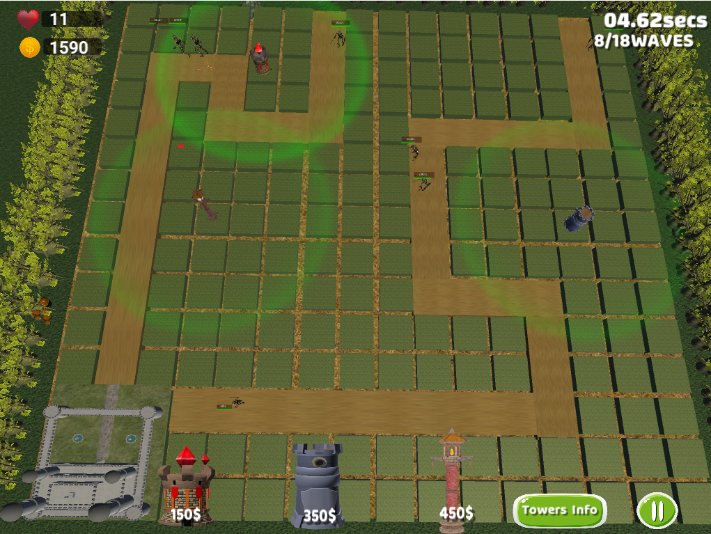
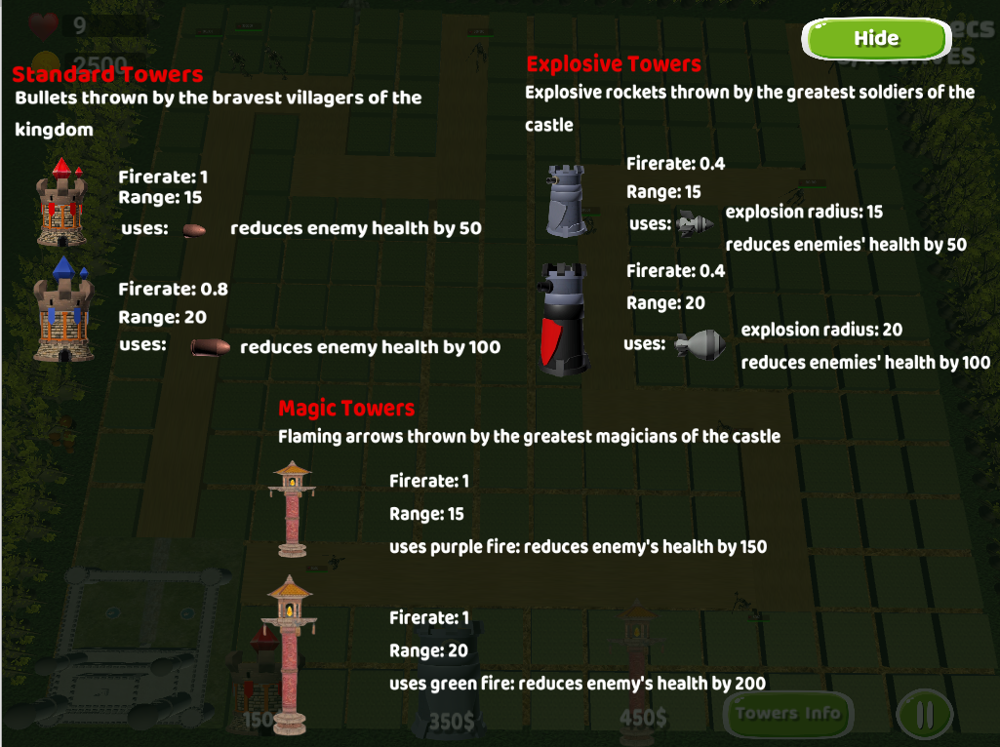

# Tower Defense Game
Welcome to Tower Defense! Your kingdom is under siege by a ruthless enemy army, and it's up to you to defend it at all costs. As the commander of your army, you must strategically place powerful towers along the winding path to fend off relentless waves of enemy forces. Your ultimate goal is to protect your castle and save your people from certain doom.

As the battle rages on, you'll need to use your quick reflexes and strategic mind to stop the enemy in their tracks. Each incoming wave will be more powerful than the last, so be sure to upgrade your towers and unlock new weapons and abilities to stay one step ahead of the enemy. Unleash the full power of your towers to annihilate each enemy wave before they breach your castle walls.

Are you ready to join the battle and defend your kingdom from the enemy invaders? Play Tower Defense now and become a hero of your realm!

# Technologies
* Unity Game Engine
* C#

The C# scripts are provided in the Assets folder of this repository.

# Features
* Boss battles with larger and more powerful enemies as the game progresses.
* A variety of tower upgrades, such as increased damage and range.
* Tower shop where players can purchase and upgrade towers.

# Downloading the game executable
* Go to the TowerDefenseUnity/Game path of this repository.
* Download the .exe game executable.
* Run the executable to start the game.

# Usage
To play Tower Defense, select 'PLAY GAME' on the Main Menu. Place towers along the path to defeat incoming enemy waves and earn coins. Use the tower shop to purchase and upgrade towers to make them even more powerful.

# Contributing
Contributions to this project are welcome
